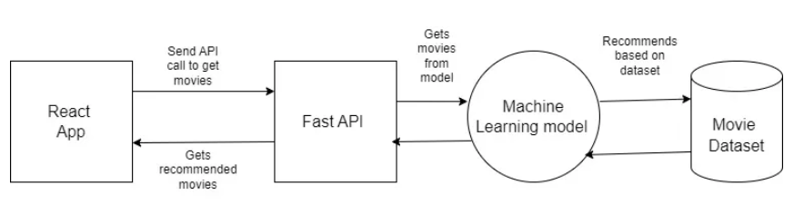

# Movie recommendation Web app using Fast API and React

## APIs to be cosntructed
- **GET /api/movies**: To return all movies in the dataset.
- **POST /api/movies/recommend**: To return all recommended movies for a given movie.
- **GET /api/movies/user_liked**: To return all similar movies which user has searched for.
- **GET /api/movies/autocomplete**: To return all matching movies having title same as prefix passed.

## Important Links
1. [Part 1](https://medium.com/@zahedialfurquan20/build-a-movie-recommendation-app-using-python-fast-api-and-react-9087fbb8d8f8)
1. [Part 2](https://medium.com/@zahedialfurquan20/build-a-movie-recommendation-app-using-python-fast-api-and-react-part-2-b8ee4660c7ce)
1. [Part 3](https://medium.com/@zahedialfurquan20/build-a-movie-recommendation-app-using-python-fast-api-and-react-part-3-1d9babba49ed)
1. [Pydantic](https://docs.pydantic.dev/latest/)
1. [FastAPI](https://fastapi.tiangolo.com/)